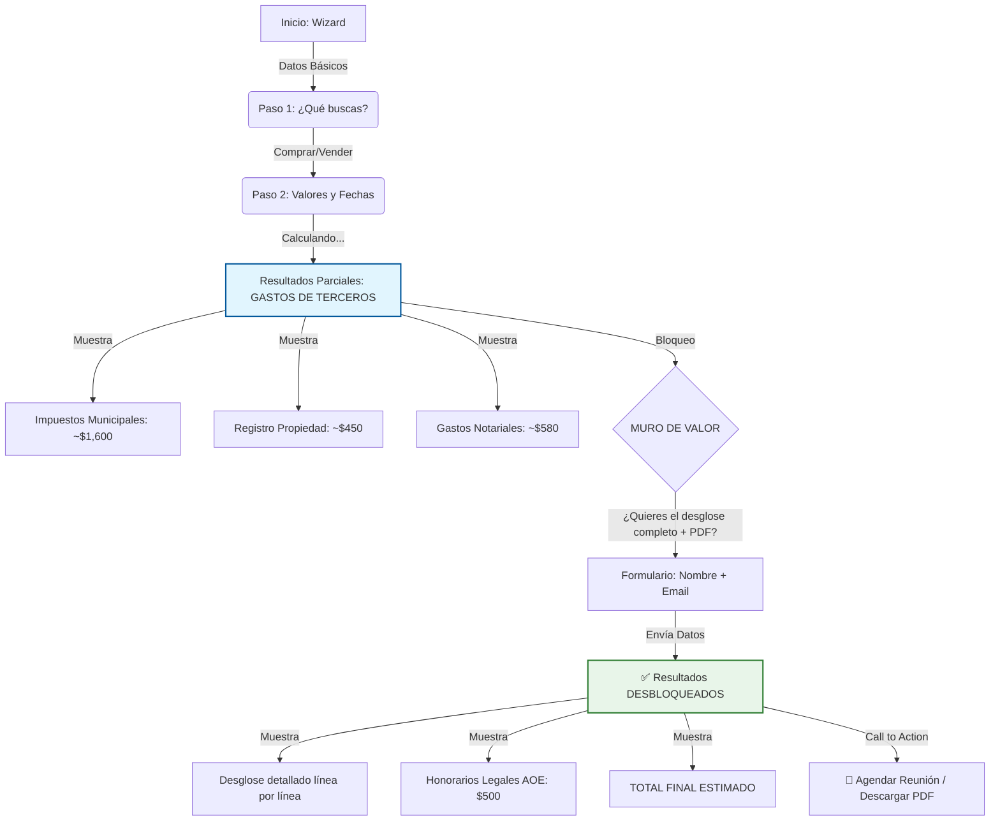
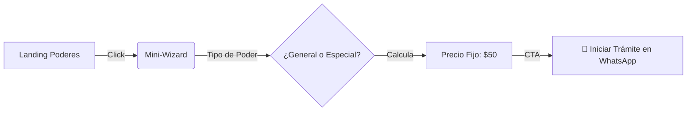

# 🔄 Previsualización de Flujos: Calculadoras AOE v2

> **Objetivo:** Validar la experiencia de usuario (UX) antes de implementar.
> **Enfoque:** Mostrar transparencia en gastos externos primero, y luego presentar nuestros honorarios.

---

## 1. 🏠 Presupuestador Inmobiliario (El "Lead Magnet" Principal)

Este flujo está diseñado para **ganar confianza** antes de pedir el email o mostrar nuestros honorarios completos.



### 🧠 Psicología del Flujo:
1. **El Gancho:** El usuario ve los impuestos (el "dolor") gratis. Siente que la herramienta funciona.
2. **El Intercambio:** Para ver el "informe oficial", da su email.
3. **La Venta:** Una vez dentro, ve nuestros honorarios ($500) como parte de una solución integral, no como una barrera inicial.

---

## 2. 🚗 Cotizador Vehicular (SaaS Rápido)

Este flujo es transaccional y directo. El objetivo es vender el contrato por $9.99.

```mermaid
graph TD
    Start[Inicio: Cotizador] -->|Datos del Vehículo| Step1(Ingresa Valor: $15,000)
    Step1 -->|Calculando...| Result[Resultado Estimado]
    
    style Result fill:#fff3e0,stroke:#ef6c00,stroke-width:2px
    
    Result -->|Desglose| R1[Notaría (Firmas): ~$30]
    Result -->|Desglose| R2[Impuesto 1%: ~$150]
    
    Result -->|La Oferta| Offer[📜 Tu Contrato Listo: $9.99]
    
    Offer -->|Opción A| Pay[💳 Pagar y Descargar]
    Offer -->|Opción B| Whatsapp[💬 Consultar en WhatsApp]
    
    Pay -->|Éxito| Download[📥 Descarga PDF Inmediata]
```

### 🧠 Psicología del Flujo:
1. **Transparencia:** Mostramos que la notaría es cara ($340+), haciendo que nuestros $9.99 parezcan irrelevantes.
2. **Sin Fricción:** No pedimos email obligatorio antes de mostrar el precio. El usuario decide rápido.

---

## 3. 📋 Servicios Menores (Poderes, Divorcios)

Flujo simplificado para capturar leads de servicios específicos.


